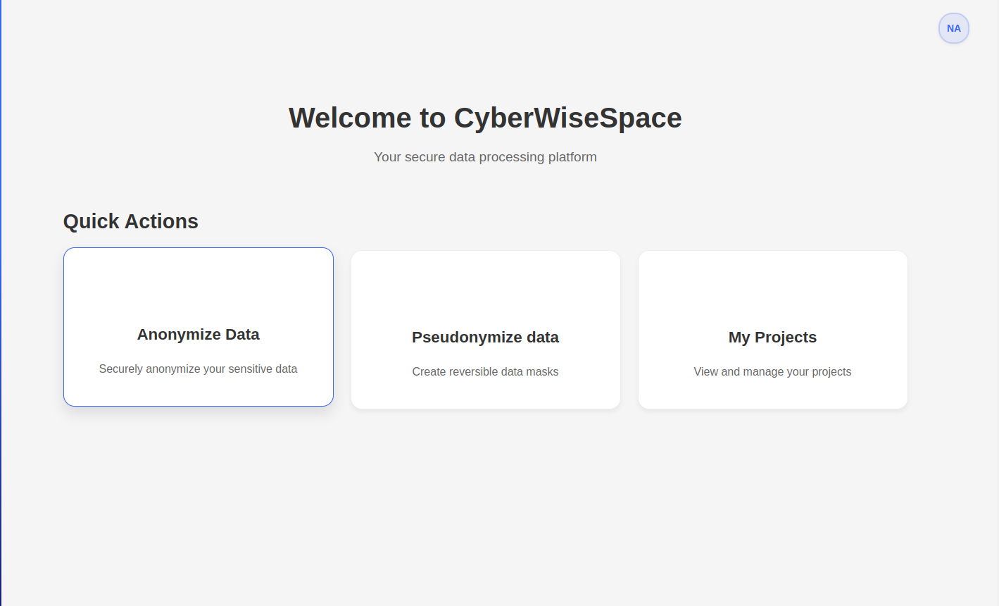
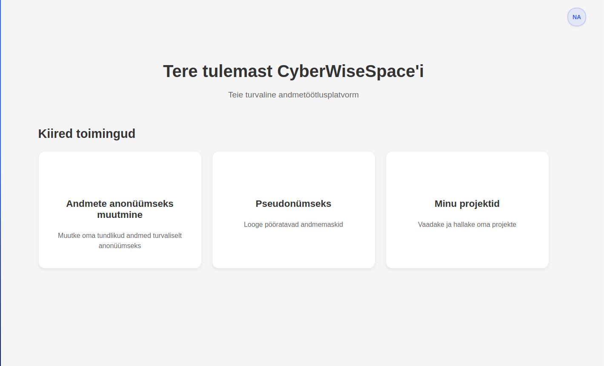
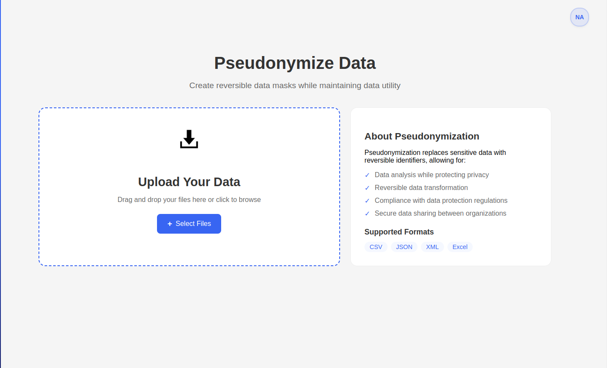
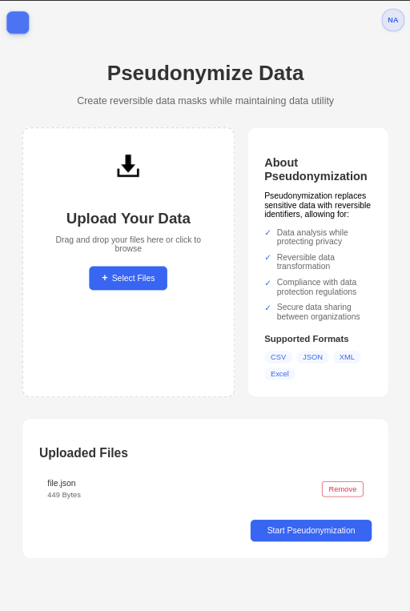
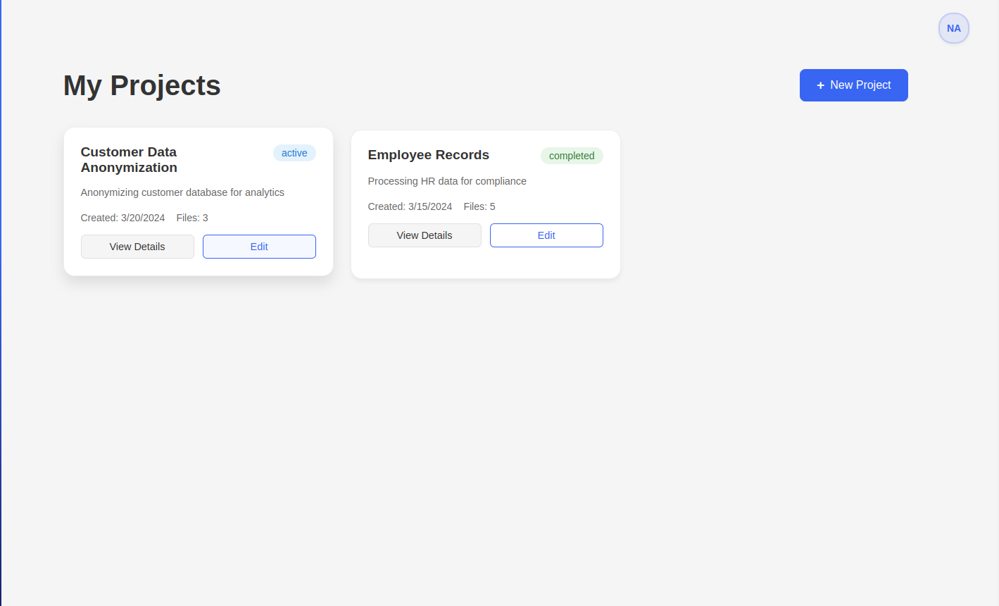

# Vue 3 + Vite

This template should help get you started developing with Vue 3 in Vite, which enables seeing real-time changes in browser

## Setup

Make sure to install the dependencies:

```bash
pnpm install
```

## Development Server

Start the development server on `http://localhost:5173`:

```bash
pnpm run dev
```

or

```bash
pnpm dev
```

# Page Preview:

## Main Page:
| English Version | Estonian Version |
|-----------------|------------------|
|  |  |


## Pseudonymization Page:

| PC View | Tablet View |
|--------|-------------|
|  |  |

## Project Page:


